Get started with the Raspberry Pi
=================================

By now, you have probably heard of the Raspberry Pi. It is a credit card
sized inexpensive computer which you is almost as powerful as your
desktop computer 10 years ago. If you have been programming for a while,
you know that's not bad at all. This is how a Raspberry Pi looks like:

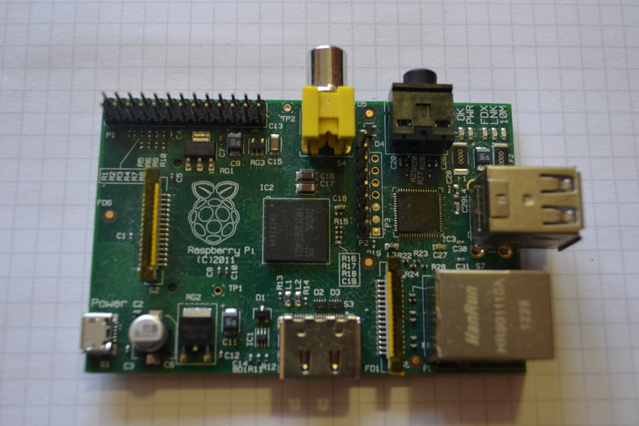

   Raspberry Pi

Specifically, this is the Model B of the Raspberry Pi. It has a
System-on-a-Chip housing a ARM core, GPU, DSP and on-board RAM. The
model I am using has 512 MB RAM. The The older ones have 256 MB RAM. It 
has a Ethernet port (capable of 10/100 Mbps)  and 2 USB (USB 2.0)
ports. A HDMI port and a composite video output
port is available for connecting to an external display - your TV or a
HDMI capable monitor. The power requirements are frugal and a basic
micro-USB cell phone charger suffices for everyday use.

The Raspberry Pi boots from a SD card - the ones you use in your digital
camera. Here is what my setup looks like with the charger, keyboard, mouse and
SD card inserted :

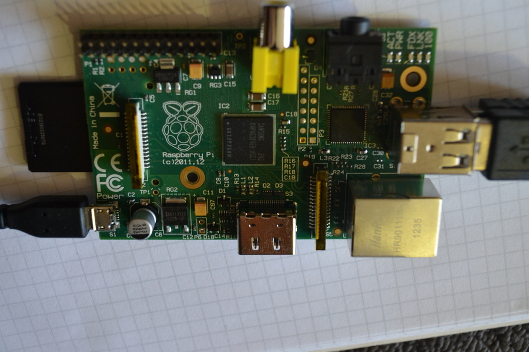

   Raspberry Pi with Charger, Keyboard, Mouse and SD Card

The power supply I am using is a 5V micro-USB charger which has a output
rating of 1200 mA. See http://www.raspberrypi.org/archives/260 for the
recommended power supply. There is no ON/OFF switch for the Pi, you
basically switch on the power supply to switch on the Raspberry Pi and shut it off
to power the device off.

See http://500px.com/amitsaha/sets/raspberry_pi for more images of the Raspberry Pi.

For the rest of this article, and later ones I will refer to the
Raspberry Pi as Pi. Before we can start the Pi, we will have to install an operating system
on the SD card. The SD card should be atleast 4 GB in size (out of which
about 3.1 GB is occupied by the Fedora operating system, leaving you
with approximately 900 MB for storing your files and installing other
software). I am using a 8 GB SD card. SD Cards of upto 32 GB are known
to be working with the Pi.

Software for the Hardware: Fedora Remix on the Pi
--------------------------------------------------

A number of choices are available when you want to select an operating
system for the Pi. Raspbian, Arch Linux, Fedora and RISC OS can all be
run on the Pi. For the purpose of this article series, we use the Fedora
18 remix, mainly because of personal preference. If you are a Fedora
user, you should have no hassles in following the articles. If you are
an user of another distro, the Fedora specific bits would be mostly
the software installation commands. Let's get started.

Download the Fedora 18 remix image from
http://scotland.proximity.on.ca/arm-nightlies/vault/f18-alpha-rpi-remix/
on another computer (I am assuming that you are using Linux).
As of this writing, Beta 2 is the latest release - the image file named
rpfr-f18-beta-2.zip. A later image may be available when you read this
article and you may use that instead. Extract this file to retrieve the
image ::

   $ unzip rpfr-f18-beta-2.zip 

Verify the md5sum ::

    [gene@fedora images]$ md5sum rpfr-f18-beta-2.img
    f107baae26804adf78dfd9f8cdb6ba7f  rpfr-f18-beta-2.img
    [gene@fedora images]$ cat rpfr-f18-beta-2.img.md5sum 
    f107baae26804adf78dfd9f8cdb6ba7f  rpfr-f18-beta-2.img

Insert you memory card and check for
the device name alloacated to it. You can check it by running the
`dmesg` command and observing the last few lines :: 

    [80004.202000] mmcblk0: mmc0:e624 SU08G 7.40 GiB 
    [80004.209723]  mmcblk0: p1

This means that the device has been allocated the file /dev/mmcblk0. You
can also see that the capacity is 7.40 GB. Next, we will use the `dd`
command to burn the image to the memory card ::

    # dd if=rpfr-f18-beta-2.img of=/dev/mmcblk0 bs=1M

The above command will finally end with something like this ::

    3145728000 bytes (3.1 GB) copied, 400.85 s, 7.8 MB/s

Time to get the Pi started. When you see the # prompt, it means the
command was executed as root and $ prompt indicates a regular user. 

Booting the Pi
--------------

Take the memory card out of your computer. Before we can boot the Pi, we have to:

1. Insert the memory card in the slot
2. Connect the Keyboard and Mouse to the USB ports
3. Connect the Pi to the TV using the HDMI Output

Now, connect the mobile phone charger to the Pi and switch on the
power. 

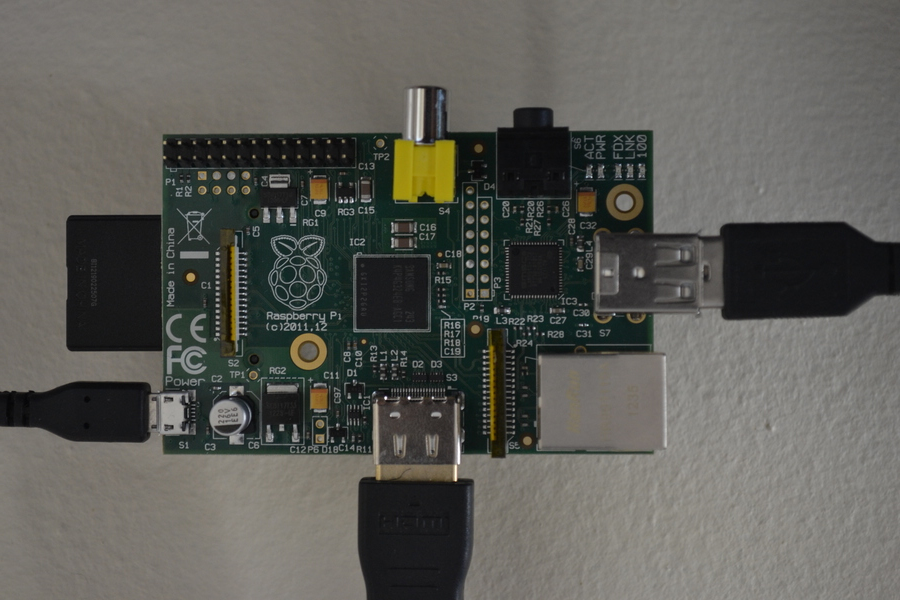

   Raspberry Pi with Charger, Keyboard, Mouse, SD Card and HDMI cable.

If you are not very unlucky, you will see Fedora booting up:

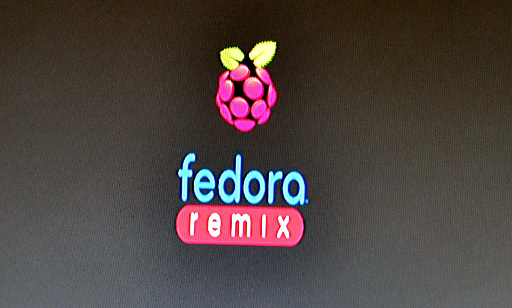

   Fedora Remix Boot Logo

The next few screens will ask you to accept the license, configure the
keyboard, create a user, setup your root user and select your time
zone. 

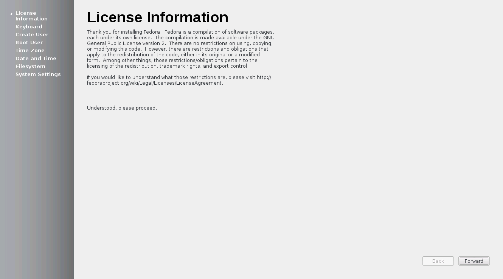

   License

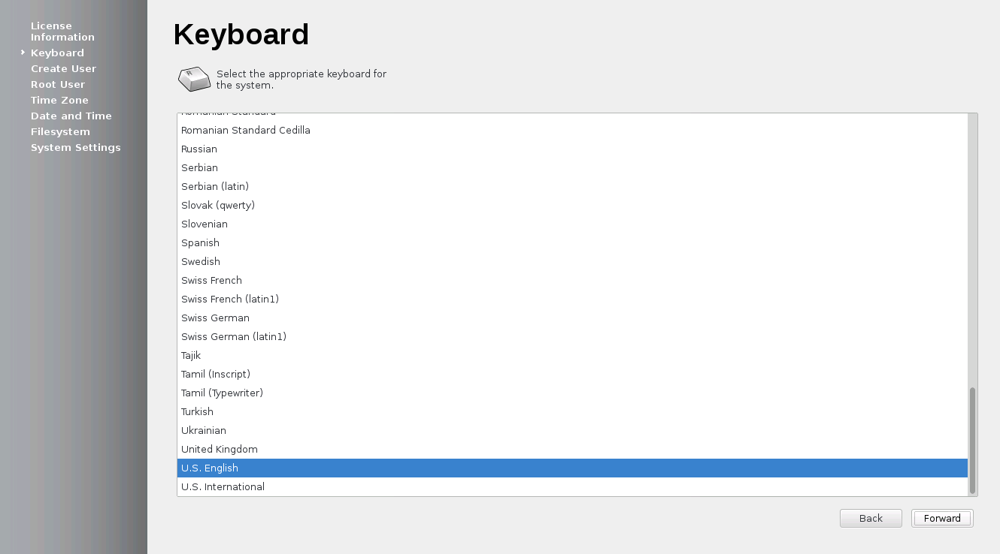

   Keyboard Selection

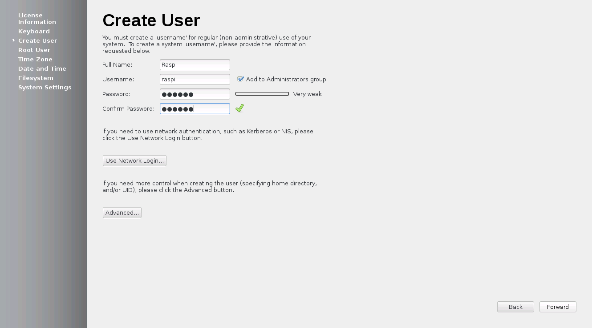

   Create User

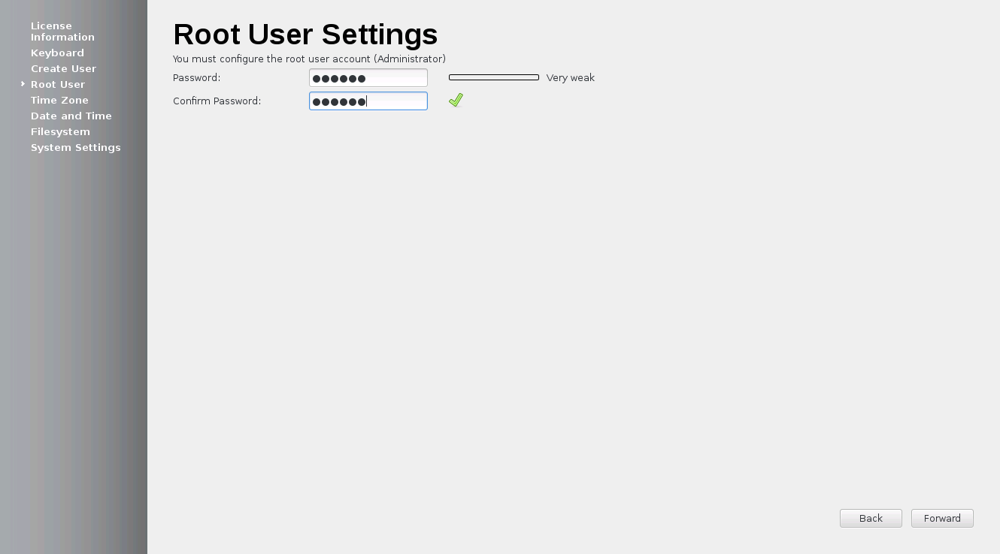

   Root User Settings

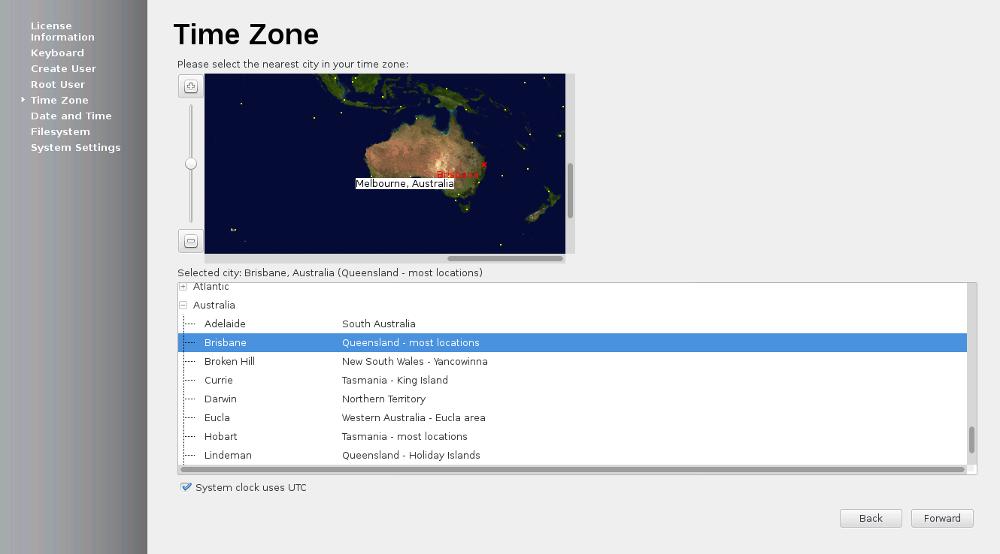

   Time Zone

Unlike your other computers, the Pi does not have a real time clock
module. Hence, it cannot keep time on its own. If you set it like you
would set your manual watch, it will reset again to an arbitrary date
when you reboot the Pi. The easiest way to make sure that your Pi always
has the right time is to retrieve it over the network using the Network
Time Protocol (NTP). Hence, we select this option in the next step. 

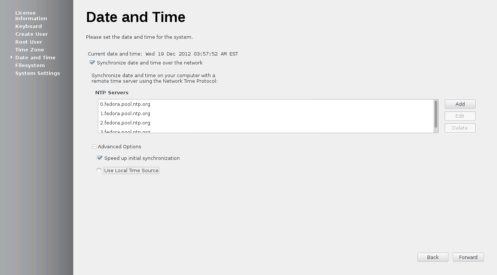

   Date and Time

The Fedora image that you installed onto the Pi occupies about 3.1 GB
space on your SD card. This is all the space that you can use on your SD
card. However, the SD card I used is 8 GB in size and hence using the
next step, you can resize the partition to use all the available space
on the SD card. You can also set (or disable) the swap file size in this step.

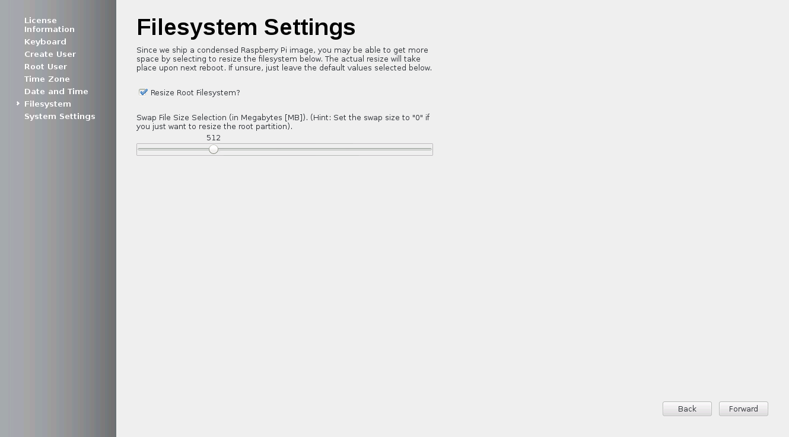

   Filesystem Settings

In the last configuration step, you can select the hostname, login type
and the video configuration. For now, we will choose graphical login and
accept the default video configuration. The default video configuration
worked perfectly for me and hence I am sticking to it. If you see that
your display has gone off the screen on any of the edges, you can play
around with selecting the alternative options here.

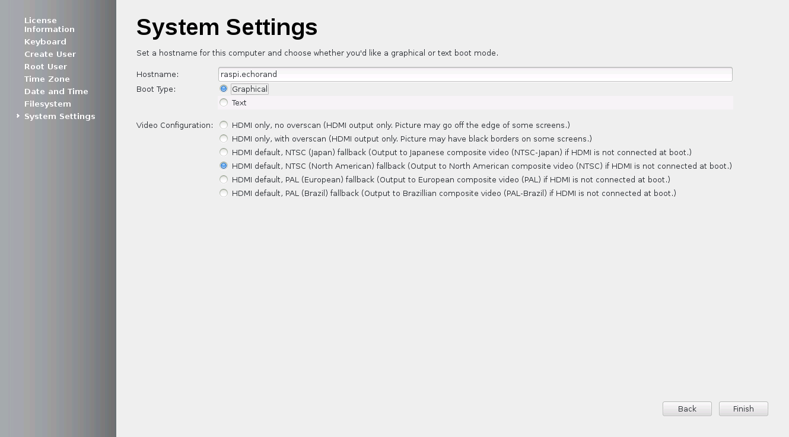

   System Settings

Once you have clicked Finish, you should get the XFCE login screen.
Here, you can login using the user name and password you selected
earlier. Note that the file system hasn't yet been resized and hence we
will reboot the Pi so that we can use all the space on the SD card.

After the reboot, you can login to your desktop and you will see
the familiar XFCE desktop running on your Pi.

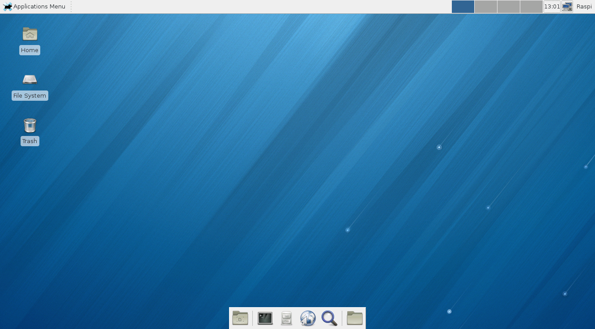
 
   XFCE Desktop

You will notice that a number of programs such as a text editor are
missing. We will simply use the `vi` editor from the terminal for any text editing tasks
in this article. 

Setting up Wired Networking
---------------------------

Open the terminal from the Applications Menu and type in the command `ip addr`. You will see that it
shows two network interfaces on your RasPi: lo and eth0. As you would
expect, the eth0 interface is not yet usable as it is not connected to a
network and assigned an IP address. Plugin your Ethernet cable and
assuming your network setup allows automatic IP address allocation using
DHCP, issuing the above command again, you will see that an IP address has now
been assigned ::

    $ ip addr show eth0
    2: eth0: <BROADCAST,MULTICAST,UP,LOWER_UP> mtu 1500 qdisc pfifo_fast state UP qlen 1000
    link/ether b8:27:eb:64:66:d1 brd ff:ff:ff:ff:ff:ff
    inet 10.0.0.5/24 brd 10.0.0.255 scope global eth0
    inet6 fe80::ba27:ebff:fe64:66d1/64 scope link 
       valid_lft forever preferred_lft forever

Now that you are connected to your local network, let us check if you
can connect to public servers ::

    $ ping www.raspberrypi.org
    PING www.raspberrypi.org (93.93.128.176) 56(84) bytes of data.
    64 bytes from www.raspberrypi.org (93.93.128.176): icmp_seq=1 ttl=44 time=311 ms
    64 bytes from www.raspberrypi.org (93.93.128.176): icmp_seq=2 ttl=44
    time=309 ms

Fedora comes with a browser `midori`, which you can use to browse
websites. Open Midori by going to Internet->Midori from the Applications
Menu and you should see the Fedora project home page open:

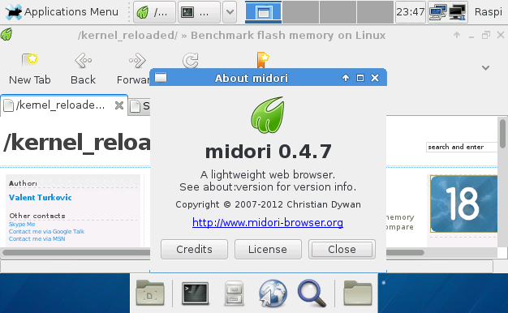
 
   Midori

If you don't quite like Midori, you can also install `Mozilla Firefox`
from the repository ::

    # yum -y install firefox

During the installation, we chose to update the date and time over the
network. Now that we are connected to the network, let us check if at
all we have the right time ::

    $ date
    Wed Dec 19 07:20:22 EST 2012
 
That may seem to be right time, since its just a month or so back. But,
actually it isn't. I am writing this article in 2013. Seems like NTP is
not working as it should because the NTP daemon is not
installed. Install it using ::

    # yum -y install ntp

Once the installation is done, start the `ntpd` and also enable it to
start on every boot using ::

    # chkconfig ntpd on

Few seconds later you will see that your Pi should have the right local time.

You can continue using the Pi using your TV as the display. However, you
can also to use it headless - login to the Pi remotely from another computer
on the same network using `ssh`,  Before we can do that, let's check if
SSH server is installed and running ::

    $ service sshd status
    Redirecting to /bin/systemctl status  sshd.service
    sshd.service - OpenSSH server daemon
          Loaded: loaded (/usr/lib/systemd/system/sshd.service; enabled)
          Active: active (running) since Tue, 2012-12-18 12:53:21 EST; 17h ago
         Process: 493 ExecStartPre=/usr/sbin/sshd-keygen (code=exited, status=0/SUCCESS)
        Main PID: 511 (sshd)
          CGroup: name=systemd:/system/sshd.service
                  └ 511 /usr/sbin/sshd -D

As you can see, the SSH server is running and ready for accepting
connections. Now, if you wish to you may unplug the TV or monitor(not before you
have noted the IP address that it has been assigned) and continue
using your Pi (and follow this article) by logging into your Pi using:
`ssh user@<ip address of pi>` from another computer on your local
network. You may of course continue exploring and following this article from the
XFCE desktop.

Know your Pi
------------

Let us now explore the Pi from the terminal:

* Disk space

Let us verify the current status of the SD card that we used to boot the
Pi from ::

    $ df -hT
    Filesystem     Type      Size  Used Avail Use% Mounted on
    rootfs         rootfs    7.3G  2.4G  4.6G  34% /
    /dev/root      ext4      7.3G  2.4G  4.6G  34% /
    devtmpfs       devtmpfs  218M     0  218M   0% /dev
    tmpfs          tmpfs     218M     0  218M   0% /dev/shm
    tmpfs          tmpfs     218M  1.1M  217M   1% /run
    tmpfs          tmpfs     218M     0  218M   0% /sys/fs/cgroup
    tmpfs          tmpfs     218M     0  218M   0% /tmp
    /dev/mmcblk0p1 vfat       51M  9.3M   42M  19% /boot

As you can see, all the space on my SD card is now available for use and
the root file system is formatted as ext4. It is interesting to note
that the /boot partition is formatted as vfat. This makes it possible to
edit the Pi's configuration file from even non-Linux systems. More on
this later.

* System Hardware

Let's now explore the processor details::

    $ cat /proc/cpuinfo

    Processor       : ARMv6-compatible processor rev 7 (v6l)
    BogoMIPS        : 697.95
    Features        : swp half thumb fastmult vfp edsp java tls 
    CPU implementer : 0x41
    CPU architecture: 7
    CPU variant     : 0x0
    CPU part        : 0xb76
    CPU revision    : 7

    Hardware        : BCM2708
    Revision        : 000f
    Serial          : 00000000e46466d1

Like I mentioned in the beginning of this article, the Pi has a Broadcom
BCM2835 System-on-a-chipthe (which houses the an ARM processor, a GPU
core, a DSP core and the SDRAM). The BCM2835 chip specification can be seen in the
above output.

You can also use the `lshw` utility to see hardware information ::

    # yum -y install lshw
    # lshw
    raspi.echorand            
        description: Computer
    	width: 32 bits
     *-core
       description: Motherboard
       physical id: 0
     *-memory
         description: System memory
    	 physical id: 0
	 size: 434MiB
      *-cpu
          physical id: 1
	  bus info: cpu@0
	  size: 700MHz
	  capacity: 700MHz
	  capabilities: cpufreq
    *-network
        description: Ethernet interface
    	physical id: 1
	logical name: eth0
	serial: b8:27:eb:64:66:d1
	size: 100Mbit/s
	capacity: 100Mbit/s
	capabilities: ethernet physical tp mii 10bt 10bt-fd 100bt 100bt-fd autonegotiation
	configuration: autonegotiation=on broadcast=yes driver=smsc95xx driverversion=22-Aug-2005 duplex=full firmware=smsc95xx USB 2.0 Ethernet ip=10.0.0.5 link=yes multicast=yes port=MII speed=100Mbit/s

I mentioned in the beginning that the Raspberry Pi I am using has 512 MB
of memory. A part of this memory is used as shared graphics memory and
the remaining is used by the operatings system. By default, 64 MB of RAM
is used as shared graphics memory and hence the system memory is shown
as 434 MB above.  That adds upto 498 MB with the remaining memory
reserved by the Kernel.

Depending on what you plan to do with your Pi, you can adjust the shared
graphcis memory. If you plan to run the Pi headless, assigning 32 MB of
shared graphics memory may be a good idea. On the other hand, if you
intend to use the desktop, keeping the default 64 MB shared memory (or
even increasing it to 128 MB) may result in better desktop
experience. We will learn how you can configure the shared memory value
in a later part of this article.

The Linux distribution details and the Kernel version can be obtained
using ::

    $ uname -a
    Linux raspi.echorand 3.2.27 #1 PREEMPT Mon Nov 19 17:16:07 EST 2012 armv6l armv6l armv6l GNU/Linux

    $ cat /etc/system-release
    Fedora remix release 18 (Raspberrypi Fedora Remix)

You can check your firmware version with the command `vcgencmd`. First
install the package `raspberrypi-vc-utils` ::

    # yum -y install raspberrypi-vc-utils
    
Now you can check the firmware version, like so ::

    # vcgencmd version
    Nov 22 2012 18:12:01 
    Copyright (c) 2012 Broadcom
    version 352766 (release)

Troubleshooting and Configuration
---------------------------------

One of the main points of concern in getting the Pi working is the
display. You may face the following two simplest of problems:

* No display: The first point of failure that can happen is that you do
  not see anything on the TV at all. First check, if the PWR and ACT
  LEDs are both glowing on your Pi. If yes, your Pi has booted
  correctly, but there is a problem with the display. If you are using
  the HDMI output, then plug out the HDMI cable and insert the
  appropriate TV cable into the composite video output. If you can see
  the display, great. If you can't, reboot the Pi. You can blindly
  (since you don't have a display or networking configured), press
  Ctrl-Alt-Del, or simply power off and then power on the Pi. If you see
  the display now, great. If you still don't see the display, check your
  cables and the input source on your TV. You can
  play around with the configuration settings as explained at the end of
  this section, 

* Overscan and Underscan Issues: If you see the display, but it doesn't
  fill the entire screen or overshoots the screen, you can fix this by
  tweaking with some of the settings and rebooting your Pi.

The `/boot` directory on your Pi contains a file `config.txt`, which is
where you can specify hardware configuration details for the Pi. This file obeys
a key=value format, where `key` is a parameter controlling an aspect of
the Pi and it is set to the specified `value`. When you open the file,
you will see that it already contains some lines of text such as ::

    $ cat /boot/config.txt
    # Raspberry Pi configuration file
    #
    # Composite video mode:     NTSC (North America)
    # Composite aspect ratio:   4:3
    # Overscan:                 Enabled, 15 pixels
    # HDMI resolution:          From EDID
    # HDMI sound:               Enabled
    #
    # Text fields for firstboot module follow:
    #
    #Title: HDMI default, NTSC (North American) fallback
    #Desc: Output to North American composite video (NTSC) if HDMI is not connected at boot.
    #

    sdtv_mode=0
    sdtv_aspect=1
    overscan_left=15
    overscan_right=15
    overscan_top=15
    overscan_bottom=15
    hdmi_drive=2

All the above lines specify various aspects of your display. Depending
on what you chose during the firstboot configuration, the values may be
different.

If you are facing overscanning or underscanning issues, you can try
modifying the values of the relevant keys above. If you don't see the
display at all, you can mount your memory card on your computer and edit
the config.txt file by hand and see if that helps.

Earlier, we discussed about the shared graphics memory on your Pi. For example, we
can specify that we want 32 MB of the RAM allocated for shared graphics
memory by adding the line: `gpu_mem=32` to the config.txt file.

To know more about this config file, please see the link in the
resources section.

The `/boot` directory also contains a file called `cmdline.txt`. In this
file, you can specify parameters that you want to pass to the Kernel at
boot ::

    $cat /boot/cmdline.txt 
    dwc_otg.lpm_enable=0 console=ttyAMA0,115200 kgdboc=ttyAMA0,115200 console=tty1 root=/dev/mmcblk0p2 ro rootfstype=ext4 rootwait quiet

Next
----

Okay, so we have a Raspberry Pi running Fedora 18 remix and we can
either work on it from the GUI (XFCE desktop) or by logging into it
remotely using `ssh`. In the next part of this series of articles, we
will explore some interesting things you could do with the Pi.

Power off the Pi using ::

    # poweroff

Meanwhile, if you have a spare SD
card, you may want to see how the other operating systems like Raspbian
and Arch Linux look like on the Pi.

Links and Resources
-------------------

You have to keep in mind that most of these guides are written with the
operating system as Raspbian in mind. If you cannot figure out something
equivalent on Fedora, let me know.

1. Raspberry Pi FAQs: http://www.raspberrypi.org/faqs
2. What are those LED's on the Pi?: http://www.raspberrypi.org/faqs
3. Raspberry Pi Hardware: http://elinux.org/RPi_Hardware
4. Raspberry Pi Basic Hardware Setup: http://elinux.org/RPi_Hardware_Basic_Setup
5. Troubleshooting the Pi: http://elinux.org/R-Pi_Troubleshooting
6. Raspberry Pi configuration: http://elinux.org/RPiconfig
7. Basics of Yum: http://yum.baseurl.org/wiki/YumCommands
8. Network Time Protocol: http://en.wikipedia.org/wiki/Network_Time_Protocol
9. Raspbian and Arch Linux for the Pi:http://www.raspberrypi.org/downloads
10. Raspberry Pi Forums: http://www.raspberrypi.org/phpBB3/

Author
------

Amit Saha blogs at http://echorand.me and can be reached via email at
amitsaha.in@gmail.com. 
