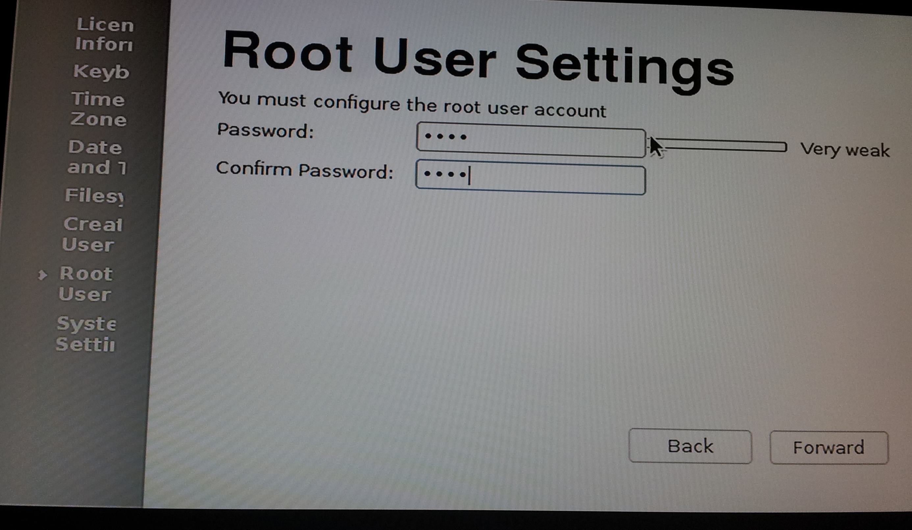

Installing Fedora Linux
=======================

Start from here_.

.. _here: http://zenit.senecac.on.ca/wiki/index.php/Raspberry_Pi_Fedora_Remix

Installer:

.. image:: _static/images/fedora_pi1.png
   :scale: 100
   :alt: alternate text

Downloading image:

.. image:: _static/images/fedora_pi2.png
   :scale: 100
   :alt: alternate text

Write to the disk:

.. image:: _static/images/fedora_pi3.png
   :scale: 100
   :alt: alternate text

Install complete:

.. image:: _static/images/fedora_pi4.png
   :scale: 100
   :alt: alternate text

Configuration
-------------

Root file system resize:

.. image:: _static/images/fedora_pi5.png
   :scale: 20
   :alt: alternate text

Create user:

.. image:: _static/images/fedora_pi6.png
   :scale: 20
   :alt: alternate text

Root user:

System Settings:

.. image:: _static/images/fedora_pi8.png
   :scale: 20
   :alt: alternate text

Login:

.. image:: _static/images/fedora_pi9.png
   :scale: 20
   :alt: alternate text

Setting up for remote access
----------------------------

SSH server should already be installed and started in your Fedora
installation. To check::

    # service sshd status
    Redirecting to /bin/systemctl status  sshd.service
    sshd.service - OpenSSH server daemon
              Loaded: loaded (/usr/lib/systemd/system/sshd.service; enabled)
    	      Active: active (running) since Thu, 01 Nov 2012 12:06:23 +1000; 9h ago
	  Main PID: 223 (sshd)
            CGroup: name=systemd:/system/sshd.service
                  └ 223 /usr/sbin/sshd -D

and then::

    # ssh localhost
    root@localhost's password: 
    Last login: Thu Nov  1 21:13:07 2012 from zion.gateway
    # who
    root     pts/0        2012-11-01 21:13 (zion.gateway)
    root     pts/3        2012-11-01 22:07 (localhost)

We are setup for remote login now. So you may now disconnect the TV jack
from your Raspberry Pi. The network cable must stay on.

Web-based Access
----------------

Using wssh_ you can SSH into your Pi using a browser. Here's
how. Install the dependencies ::

    # yum -y install python-devel libevent-devel python-setuptools
    # pip-python install gevent flask paramiko gevent-websocket wssh

Now, start wsshd ::

   # wsshd
    wsshd/0.1.0 running on 0.0.0.0:5000

Now, from any other computer on your network, visit the URL,
<raspi-ip>:5000 and you will see a login screen where you can enter
the username, hostname/IP you want to connect to and use the
password/private key authentication to connect to the remote
host. Since the wssh daemon is running on your Pi, specifying
localhost would mean the Pi itself and use the IP address for any
other computer on your network. The login screen looks like this:

And then you can use the terminal, like you would normally do:

.. _wssh: https://github.com/aluzzardi/wssh

It is a good idea to run wsshd in the background using a daemonizer
program like zdaemon (more on this later). Install zdaemon using ::

    # pip-python install zdaemon

Run wsshd using zdaemon ::

     # zdaemon -p wsshd start
     . . . 
     daemon process started, pid=5277

Effectively, this gives you an entry point to your local home network
from the Web browser. To make this possible outside your home network
and being able to access it from anywhere, literally, you can setup
tunelling. You can either play with your router configuration to set
up port forwarding or simply use a tunelling service such as
PageKite_. Install it using :: 

    # curl -s https://pagekite.net/pk/ |sudo bash

Before starting to use this service, you should make yourself familiar
with the pricing of the service. 

Before you can start using the service, you have to sign up using ::

    # pagekite.py --signup

Once you are done with that, you can setup your Pi for exposing the
5000 port using ::

# pagekite.py 5000 mypi.pagekite.me

And you should have your SSH login screen at your chosen kitename:
http://mypi.pagekite.me in this case.
  
.. _Pagekite: https://pagekite.net

Updating and Adding RPM fusion
------------------------------

Install RPMFusion repositories::

    # yum localinstall --nogpgcheck
      http://download1.rpmfusion.org/free/fedora/rpmfusion-free-release-stable.noarch.rpm
      http://download1.rpmfusion.org/nonfree/fedora/rpmfusion-nonfree-release-stable.noarch.rpm

Update system::
    
    # yum -y update

Kernel version::

    # uname -r
    3.2.27

Time Synchronization
--------------------

The Pi does not have a real time clock, which means the Pi cannot keep
track of time across reboots. The solution is to run the ntpd daemon and use a NTP
server to synchronize the time everytime you reboot.

Install the ntpd and ntpdate utilities::

   # yum -y install ntp ntpddate

Although, the default NTP servers works, you may want to edit the
/etc/ntp.conf to include NTP servers closer to your geographic
location_. 

.. _location: http://www.pool.ntp.org/zone

And start the ntp service ::

   # service ntp start

The date and time should now be reflected to be your local time. To
start the ntp service on boot ::

   # chkconfig ntpd on

You will see that few seconds after the boot, the time is always set
to the local time. 

If you have the need to add one, see Adafruit's tutorial_.

.. _tutorial: http://learn.adafruit.com/adding-a-real-time-clock-to-raspberry-pi/overview

