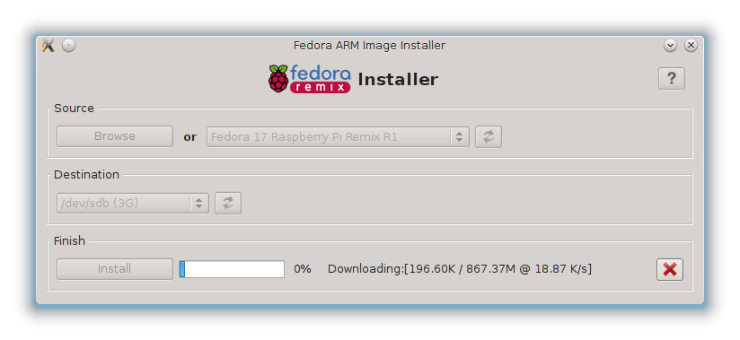

Installing Fedora Linux
=======================

Installer:

.. image:: _static/images/fedora_pi1.png
   :scale: 100
   :alt: alternate text

Downloading image:

Write to the disk:

Install complete:

.. image:: _static/images/fedora_pi4.png
   :scale: 100
   :alt: alternate text

Configuration
-------------

Root file system resize:

.. image:: _static/images/fedora_pi5.png
   :scale: 20
   :alt: alternate text

Create user:

Root user:

.. image:: _static/images/fedora_pi7.png
   :scale: 20
   :alt: alternate text

System Settings:

.. image:: _static/images/fedora_pi8.png
   :scale: 20
   :alt: alternate text

Login:

.. image:: _static/images/fedora_pi9.png
   :scale: 20
   :alt: alternate text

Setting up for remote access
----------------------------

SSH server should already be installed and started in your Fedora
installation. To check::

    # service sshd status
    Redirecting to /bin/systemctl status  sshd.service
    sshd.service - OpenSSH server daemon
              Loaded: loaded (/usr/lib/systemd/system/sshd.service; enabled)
    	      Active: active (running) since Thu, 01 Nov 2012 12:06:23 +1000; 9h ago
	  Main PID: 223 (sshd)
            CGroup: name=systemd:/system/sshd.service
                  └ 223 /usr/sbin/sshd -D

and then::

    # ssh localhost
    root@localhost's password: 
    Last login: Thu Nov  1 21:13:07 2012 from zion.gateway
    # who
    root     pts/0        2012-11-01 21:13 (zion.gateway)
    root     pts/3        2012-11-01 22:07 (localhost)

We are setup for remote login now. So you may now disconnect the TV jack
from your Raspberry Pi. The network cable must stay on.

Updating and Adding RPM fusion
------------------------------

Install RPMFusion repositories::

    # yum localinstall --nogpgcheck
      http://download1.rpmfusion.org/free/fedora/rpmfusion-free-release-stable.noarch.rpm
      http://download1.rpmfusion.org/nonfree/fedora/rpmfusion-nonfree-release-stable.noarch.rpm

Update system::
    
    # yum -y update

Kernel version::

    # uname -r
    3.2.27

